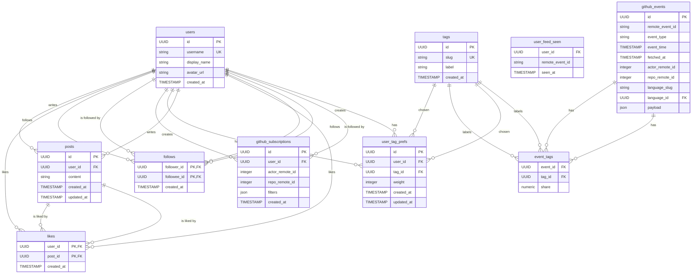
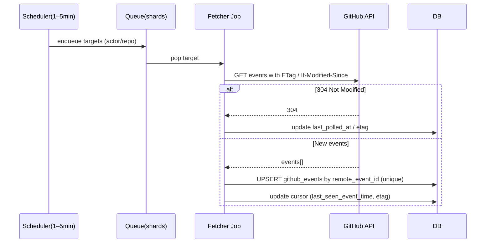

# ハッカソンW班 プロダクト

## 概要
GitFeedはソフトウェアエンジニアのための情報収集・交流サービスです。GitHubの静的な情報をTwitter ライクにユーザーが選択した形式で取得でき、かつTLでの発信も可能とし、エンジニアの情報収集の効率化および交流の活発化を目的とします

### 動機(発案者であるTsukuneA1の)
自分はエンジニアの情報を主にTwitterやQiitaやZennなど(たまにYouTube)で取得することが多いです。ただ最近はそこでストレスに感じることがあります。それは「AI系の発信が多すぎて疲れる」ということです。~~特にAI驚き屋みたいな非エンジニアのくせにこのAIがすごいとか言ってインプレッション稼ぎと情報商材を売っている輩は心底嫌いです。~~ 自分はAIツールへのキャッチアップは生産性向上のためにもちろんすべきですが、本質はAIのモデルや性能ではなくその結果生み出される人間が介入したうえでの最終的な生成物の評価だと思っています。なので ~~インプゾンビやポジショントークしかできないクズがいない~~ クリーンな情報収集ツールを作ろうと考えました。エンジニアの一次情報は結局コードなのでGithubのAPIを叩き受動的に他人の活動を垂れ流し、Twitterライクではあるがクリーンなコードの情報を取得できる場を作りたいというのが第一の動機です。またエンジニアの主要な交流ツールがコードと直結しないTwitterであるということも疑問に思っています(ここはGithubでもConversationとかありますが、あれはクローズドでもう少し情報をオープンに取ってこれたらなという思想があります)。時間が余ればAIにリソースを与えてエンジニアの能力向上を促すような教師的な役割をさせたり出来たらなと思います。自分は思想が強いので少し大げさかもしれませんが、こういうことを考えているエンジニアは少なからずいるのではと思っています。

## 導線詳細

### ER図(暫定)

### シーケンス図(暫定)

### ユーザーストーリー
EPIC := 大き目のテーマ、複数のユーザーストーリーを内包
US(User Story) := ユーザーストーリー、ユーザー視点の最小単位の要求
P0/P1/P2 := Priority 優先度 

**EPIC:認証**
<br/>
US-01(P0)
   - 「Sign in with Github」でサインイン
   - 初回サインインでなければ/feedへ
   - 初回サインインであれば初期設定ページへ

**EPIC:初期設定**
<br/>
US-02(P0)
  - 「言語タグ」を3~5個選ぶ
  - その結果Feedに重みが反映
  - user_tag_prefsに保存

**EPIC:Feedを見る(コード一次情報)**
<br/>
US-03(P0)
  - `/feed`を開く
  - 新しい順にGithubイベントカードが表示される
  - 3種(PR, Release, Issue)のカードが表示される
  - スクロールで10件ずつ(暫定)ずつ追加取得
  - 取得件数が0件の場合`/discover`への導線
US-04(P0)
  - Githubイベントカードから実際のgithub上のURLに遷移
  - 新規タブで開く
US-05(P1)
  - `PRのみ/merge済みのみ/言語`などフィルタできる
  - 表示が即反映

**EPIC:対象を見つけてサブスクリプション**
<br/>
US-06(P0)
  - `/discover`で`repo/actor`を検索
  - サジェストから選択
US-07(P0)
  - filterをセットして「Save」
  - github_subscriptionにレコードが追加されFeedに反映

**EPIC:自分の購読を管理**
<br/>
US-08(P0)
  - `/subscriptions`で一覧が見える
  - 対象とfilters要約・未読件数が見える
  - 0件時は`/discover`へ導線を設置
  - 削除/一時停止が可能

## 技術選定
### フロントエンド
- **Next.js**: Reactのメインは仮想DOMだがjsxがHTML/CSSライクに書ける。オーバースペックだが他の軽量な依存で作ろうとすると学習コストが高くなる
- **TailwindCSS**: CSSを分離する必要がないため即決
- **shadcn/ui**: 他のUIライブラリ(MUI, chakra)は独自の思想があり、割とプレーンなものを使いたい。shadcnにチームの思想は宿らせることはできないが、プレーンなまま使う。v0とかとの互換性があるのも良き
- **Zustand**: Reduxは学習コストが高くcontext apiはややパフォーマンスが悪い

### バックエンド
- **Ruby on Rails API Mode**: 古い枯れた技術だが自分(TsukuneA1)が多少慣れている&wantedlyの求人数もそこそこある。学習の価値はあるので採用。あとgoとかで自分でアーキテクチャ組もうとしても恐らく破壊が起こるのでやれないしやりたくない。
- **omniauth**

## 競合および参考にしたいアプリ、サービス
- **daily.dev**: 記事や動画などをスクローリングしてくる。完成度が高すぎて同路線で行くと勝負にならない
- **Github**: そもそもサービスとしての提供したい機能・目的が違う

## 🚀 主要機能

### 予定機能（デモ版で実装済み）
1. **GitHub OAuth認証** - 安全なログイン・認証システム
2. **リポジトリデータ同期** - GitHub APIを通じた自動データ取得
3. **AIプロフィール解析** - OpenAI APIによるスキル・経験の自動分析
4. **コード品質解析** - リポジトリのコード品質評価とメトリクス算出
5. **エンジニアネットワーキング** - スキル類似度によるエンジニア発見・マッチング
6. **AI チャット機能** - プロフィールに関するQ&A機能

## 🛠 技術スタック

技術的な詳細は [docs](./docs) ディレクトリを参照してください。

### Core Technologies
- **Backend**: Rails 8.0.2 (API mode) + PostgreSQL
- **Frontend**: Next.js 15 (App Router) + TypeScript + Tailwind CSS
- **AI Integration**: OpenAI GPT-3.5-turbo
- **Authentication**: GitHub OAuth + JWT
- **External APIs**: GitHub REST API, Octokit

## ⚡ クイックスタート

### 前提条件
- **Go Task**: タスクランナー ([インストールガイド](https://taskfile.dev/installation/))
- **pnpm**: フロントエンドパッケージマネージャー
- **Ruby 3.3.7**: バックエンド環境
- **Node.js 20+**: フロントエンド環境
- **PostgreSQL**: データベース
```

### 🚀 Task による一括開発環境セットアップ
```bash
# 依存関係のインストール
task install

# 開発サーバー起動（両方同時）
task dev

# 個別起動も可能
task backend:dev   # Rails (port 3000)
task frontend:dev  # Next.js (port 3001)
```

### 🔍 コード品質チェック
```bash
# 全体のコード品質チェック
task ci:all

# フロントエンド（Biome + ESLint + TypeScript）
task ci:frontend

# バックエンド（RuboCop）
task ci:backend
```

### 🧹 コードフォーマット
```bash
# 全体のフォーマット実行
task format

# 個別フォーマット
task frontend:format  # Biome + ESLint自動修正
task backend:format   # RuboCop自動修正
```

### 🪝 Pre-commit Hooks
```bash
# Git hooksを設定（初回のみ）
task hooks:install

# Pre-commit hookをテスト実行
task hooks:test

# コミット時に自動でCI相当のチェックが実行されます
git commit -m "feat: new feature"  # 自動でBiome/ESLint/TypeScript/RuboCopが実行
```

### 従来の手動起動方法
```bash
# Backend
cd backend
bundle install
rails db:create db:migrate
rails server -p 3000

# Frontend (別ターミナル)
cd frontend
pnpm install
pnpm dev  # port 3001で起動
```

アプリケーション：
- **Backend API**: http://localhost:3000
- **Frontend**: http://localhost:3001

## 🔄 CI/CD パイプライン

このプロジェクトでは**GitHub Actions**による自動CI/CDが設定されています：

### 📋 ワークフロー詳細
```bash
# ローカルでのCI実行（GitHub Actions相当）
task ci:all  # 全ての品質チェックを実行
```

## 📚 ドキュメント

- [技術仕様書](./docs/technical-specification.md)
- [API仕様](./docs/api-specification.md)
- [デプロイガイド](./docs/deployment-guide.md)
- [開発ガイド](./docs/development-guide.md)
- [Task ランナー詳細](./docs/development-guide.md#task-runner)
- [CI/CD パイプライン詳細](./docs/ci-cd-guide.md)

## 後日談、というか今回のオチ
PMだったtsukuneA1から今回のハッカソンの振り返りを書かせていただきます。
このセクションより↑に書いてある内容はPJが始まって2週間くらいで書いたもので最終的な実装とは齟齬があります。

PJの経緯を順に書いていきます。最終的な発表で使ったスライドは以下のものになります<br/>
[google slide](https://docs.google.com/presentation/d/1aol6UERLJP0c_VJcH8mtELUwOrUpq0vr6EqgMya1LuA/edit?usp=sharing)

以下常体
### プロジェクト開始期
前提として自分は週に7日、で45~50時間ほどハッカソン期間アルバイトをしており、ハッカソンに取れるリソースは多くなかった。他の開発メンバーに関してインターンでソフトウェア開発を行った経験があるものが2名(以下Sさん、Rさん)、チーム開発自体経験がなくGit操作ができないものが3名(以下K君、H君、Nさん)、インターン経験半年ほどの自分の計6名で開発をしていた。<br/>

最初にPMになった時にこのハッカソンのゴールを明確化する必要があると感じた。↑の前提を考慮した結果
1. ハッカソンの最後に自分たちの勉強したことを全メンバーが言語化でき、且つその内容が各メンバーのやりたいことに合致している
2. アプリのコンセプトやその実現度をアピールできる<br/>

上記2点をハッカソン全体のゴールと定めた。
一方で個人のゴールとして、元々このアプリ案はハッカソンがあろうがなかろうがどのみち作成しようと思っていたのでハッカソンでその試金石にしようとしていた。またそれ以外にもPMをすることで軽いマネジメント経験をしてみたかった。
### プロジェクトが開始し、合宿当日までの期間
全体での目標1., 2.を達成するためにやっていたことを以下で説明する

1.を達成するためにやったことを述べる。まずアプリの案が自分の提案したもので決定した段階で各メンバーに対し、このハッカソンで達成したい目標を聞いた。Sさん、Rさんに関してはバックエンドの開発経験、それ以外の3人に関してはまずチーム開発の経験を積みたいということだった(と記憶している)。やや失礼だが事実としてこのチームはPMである自分の開発経験が他5人と比べてWebアプリという分野に限定し、遥かに多かった。そのため実装を十分に行えないメンバーに設計を任せるのは不可能と判断し、実装のみのタスクを自分が振ろうと考えた。そしてそのやり方が各人の目標と照らしても一番合理的だと思った。そこで大体最後にどのようなことをスライドにまとめさせるか考え、逆算してタスクを振っていた。言語化ができるよう、実装段階やPRのレビュー段階で最低限の補助をし、技術記事のリンクなども貼りながら誘導した。

2.を達成するためにやったことを述べる。↑で述べたように設計は自分以外の5人に任せることは不可能だと考えたので基本的に自分が頑張るで解決しようとしていた。ただアプリ案自体が新規性のあるコンセプトでやろうとしていたので、要件定義および設計がしっかりしていないとガタガタになり実装の時にタスクがうまく振れないという状況になってしまった。READMEにできるだけまとめていってはいたがどうしようもなく時間が足りなかった。結局ユーザー操作はタグの選択とそこからリダイレクトしたfeedページでfeedが見れるという最小のものになった。ここは自分の見積りが甘く反省点であった。

1., 2.以外で意識していたことを箇条書きでまとめる
- 最低限週1対面で合う時間を作る→これはヘルスチェックおよび自分の思想や温度感を伝えるということがリモートで一々やっていたのでは絶対にできないと思ったから。結果的に今振り返ると週1定例だけでは足りずそれ以外にそれぞれの1 on 1を毎週やるなどをするべきだった。
- CI/CDのパイプライン、およびgitの権限設定をさっさと組み込む→正直技術力が低くAIの使い方が下手な人間は恐ろしい破壊的変更を悪気なく突っ込んでくるということが容易に予想できたのでセーフティーネットとして最低限のものをbiome, vercelのビルド, rubocopの検知で行っていた。自分の時間がなくレビューを最小限にしたいという意図も込めてここはサボらずにやろうと思っていた
- 合間合間で技術のキャッチアップをさせる時間を取る→これはgit, githubの講座や、react, next.jsの思想などの伝達を行っていた。ドキュメント読めといわれても人間はサボる(これは自分もそうでそれができる人は体感上位5%くらい)ので強制的に勉強する機会を作っていた

### 合宿当日
全体目標1., 2.の実現度および所感を述べる

1.→十分に達成できた。google slideに記述されているように各メンバーが予想以上に頑張ってくれて言語化も十分だった

2.→達成できなかった。上述したが自分の見積もりが甘く、アプリの達成目標とは乖離したものができてしまった。ただタグ選択からfeedを取ってくるという流れ自体は実演できたので最低限動くものができたということでそこはよかった

所感→
AIの出現によって開発速度が上がり経験の少ないメンバーでもなんとかなるだろうと考えて見積もりを作っていたが、思ったよりもそれで生産性は上がらず、むしろ下がったのではないかとすら感じた。理由は一つ目にそもそもAIの使い方を分かっていないことで具体的にはコンテキストの与え方が下手であること、セッションの管理ができないこと、モデルやAgentの選定がおかしいことなどがあった。二つ目に技術力の基礎やチーム開発経験がないとAIに言われたことを鵜呑みにして全く違う実装に突っ走っていたり、レビューで差し戻しが起こったときに対応が遅延する、AIにあまりにも多くの差分を作成させ、不要な技術負債を作るなどがあった。

### 全体振り返り
今回は短い期間のハッカソンで且つ開発経験の格差があるという状況だったのですべて自分がハンドリングするという状態になってしまったが本来こうあるべきではなく各々が自立的に考え、よりよい設計や技術選定の提案ができる状態がチーム開発の理想であると思う。今回はチーム開発というより教育の色が強くなってしまった。ただメンバー全員本当に頑張ってくれていて合宿当日にはよしなにタスクを振って多少設計の不備があるところを直してもらったりしていたが、自分にはない考えやアプリがよりよくなる提案をしてくれていたのでそういったものは積極的に採用したし、もっと人の意見を聞くべきだったと反省した。
今回でタスクを振る側がどういう気持ちでやっているのかを少し理解できた気がするのでインターンではプレイヤーとしてよりニーズに沿った動きができるよう行動を修正したい。
