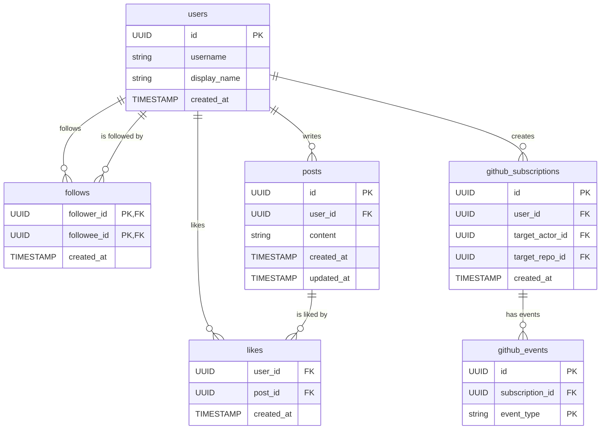

# ハッカソンW班 プロダクト

## 概要
[Service Name]はソフトウェアエンジニアのための情報収集・交流サービスです。GitHubの静的な情報をTwitter ライクにユーザーが選択した形式で取得でき、かつTLでの発信も可能とし、エンジニアの情報収集の効率化および交流の活発化を目的とします

### 動機(発案者である内呂の)
自分はエンジニアの情報を主にTwitterやQiitaやZennなど(たまにYouTube)で取得することが多いです。ただ最近はそこでストレスに感じることがあります。それは「AI系の発信が多すぎて疲れる」ということです。~~特にAI驚き屋みたいな非エンジニアのくせにこのAIがすごいとか言ってインプレッション稼ぎと情報商材を売っている輩は心底嫌いです。~~ 自分はAIツールへのキャッチアップは生産性向上のためにもちろんすべきですが、本質はAIのモデルや性能ではなくその結果生み出される人間が介入したうえでの最終的な生成物の評価だと思っています。なので ~~インプゾンビやポジショントークしかできないクズがいない~~ クリーンな情報収集ツールを作ろうと考えました。エンジニアの一次情報は結局コードなのでGithubのAPIを叩き受動的に他人の活動を垂れ流し、Twitterライクではあるがクリーンなコードの情報を取得できる場を作りたいというのが第一の動機です。またエンジニアの主要な交流ツールがコードと直結しないTwitterであるということも疑問に思っています(ここはGithubでもConversationとかありますが、あれはクローズドでもう少し情報をオープンに取ってこれたらなという思想があります)。時間が余ればAIにリソースを与えてエンジニアの能力向上を促すような教師的な役割をさせたり出来たらなと思います。自分は思想が強いので少し大げさかもしれませんが、こういうことを考えているエンジニアは少なからずいるのではと思っています。

### ER図(暫定)


### 技術選択の理由

#### Next.js を選択した理由
- **学習コストの低さ**: HTML/CSSの基礎知識の延長線上にある
- **モダンな開発体験**: TypeScriptサポート、App Routerによる直感的な開発
- **エコシステム**: React生態系の豊富なリソース
- **初学者フレンドリー**: ドキュメントが充実し、学習リソースが豊富

#### Rails を選択した理由
- **GitHub OAuth対応**: GitHubとのOAuth認可に対応した便利なgemが豊富
- **MVCアーキテクチャ**: 明確に構造化されており、初学者でも理解しやすい
- **コンベンション**: Rails Wayにより、迷いなく開発を進められる
- **エコシステム**: gem生態系による豊富な機能拡張
- **求人数**: wantedlyでgo, railsの求人数を比較したところrails 194件に対し、go193件。新規開発で使われることは少ないと思うが学習の価値はある

## 🚀 主要機能

### 予定機能（デモ版で実装済み）
1. **GitHub OAuth認証** - 安全なログイン・認証システム
2. **リポジトリデータ同期** - GitHub APIを通じた自動データ取得
3. **AIプロフィール解析** - OpenAI APIによるスキル・経験の自動分析
4. **コード品質解析** - リポジトリのコード品質評価とメトリクス算出
5. **エンジニアネットワーキング** - スキル類似度によるエンジニア発見・マッチング
6. **AI チャット機能** - プロフィールに関するQ&A機能

## 🛠 技術スタック

技術的な詳細は [docs](./docs) ディレクトリを参照してください。

### Core Technologies
- **Backend**: Rails 8.0.2 (API mode) + PostgreSQL
- **Frontend**: Next.js 15 (App Router) + TypeScript + Tailwind CSS
- **AI Integration**: OpenAI GPT-3.5-turbo
- **Authentication**: GitHub OAuth + JWT
- **External APIs**: GitHub REST API, Octokit

## ⚡ クイックスタート

### 前提条件
- **Go Task**: タスクランナー ([インストールガイド](https://taskfile.dev/installation/))
- **pnpm**: フロントエンドパッケージマネージャー
- **Ruby 3.3.7**: バックエンド環境
- **Node.js 20+**: フロントエンド環境
- **PostgreSQL**: データベース

### 環境変数設定
```bash
# ルート階層の.envファイルを編集
cp .env.example .env  # 実際には.envが既に存在
# BACKEND_PORT=3000, FRONTEND_PORT=3001 など
```

### 🚀 Task による一括開発環境セットアップ
```bash
# 依存関係のインストール
task install

# 開発サーバー起動（両方同時）
task dev

# 個別起動も可能
task backend:dev   # Rails (port 3000)
task frontend:dev  # Next.js (port 3001)
```

### 🔍 コード品質チェック
```bash
# 全体のコード品質チェック
task ci:all

# フロントエンド（Biome + ESLint + TypeScript）
task ci:frontend

# バックエンド（RuboCop）
task ci:backend
```

### 🧹 コードフォーマット
```bash
# 全体のフォーマット実行
task format

# 個別フォーマット
task frontend:format  # Biome + ESLint自動修正
task backend:format   # RuboCop自動修正
```

### 🪝 Pre-commit Hooks
```bash
# Git hooksを設定（初回のみ）
task hooks:install

# Pre-commit hookをテスト実行
task hooks:test

# コミット時に自動でCI相当のチェックが実行されます
git commit -m "feat: new feature"  # 自動でBiome/ESLint/TypeScript/RuboCopが実行
```

### 従来の手動起動方法
```bash
# Backend
cd backend
bundle install
rails db:create db:migrate
rails server -p 3000

# Frontend (別ターミナル)
cd frontend
pnpm install
pnpm dev  # port 3001で起動
```

アプリケーション：
- **Backend API**: http://localhost:3000
- **Frontend**: http://localhost:3001

## 🔄 CI/CD パイプライン

このプロジェクトでは**GitHub Actions**による自動CI/CDが設定されています：

### 🚦 自動品質チェック
- **Frontend**: Biome + ESLint + TypeScript型チェック
- **Backend**: RuboCop コードスタイルチェック
- **Trigger**: `main`/`develop`ブランチへのPush・Pull Request

### ⚡ 高速フィードバック
- テスト・ビルドを除外した軽量CI設計
- 開発中の迅速なフィードバックを重視
- 並行実行による最適化

### 📋 ワークフロー詳細
```bash
# ローカルでのCI実行（GitHub Actions相当）
task ci:all  # 全ての品質チェックを実行
```

## 📚 ドキュメント

- [技術仕様書](./docs/technical-specification.md)
- [API仕様](./docs/api-specification.md)
- [デプロイガイド](./docs/deployment-guide.md)
- [開発ガイド](./docs/development-guide.md)
- [Task ランナー詳細](./docs/development-guide.md#task-runner)
- [CI/CD パイプライン詳細](./docs/ci-cd-guide.md)
